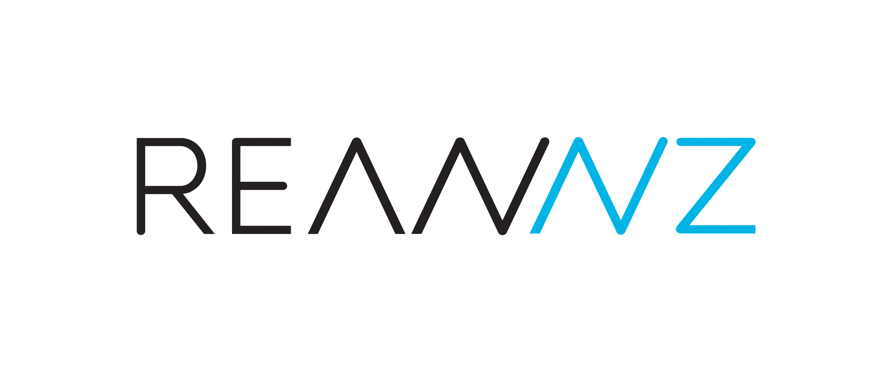

	

- - -
<h1 align="center">Introduction to Shell</h1>

!!! table "Episodes"

    [1. UNIX, Linux & UNIX Shell](./1-intro2shell.md){ .md-button .md-button--primary } 

    [2. Access the Shell and Introduction to Shell Commands](./2-intro2shellcommands.md){ .md-button .md-button--primary }

    [3. Introduction to Shell Commands - 2](./3-intro2shellcommands.md){ .md-button .md-button--primary } 

 

!!! key "License" 

    Genomics Aotearoa / REANNZ "Intermediate Shell for Bioinformatics" is licensed under the **GNU General Public License v3.0, 29 June 2007** . ([Follow this link for more information](https://github.com/GenomicsAotearoa/shell-for-bioinformatics/blob/main/LICENSE))
    
!!! info ""

!!! copyright "Attribution Notice"

    * This workshop material is heavily inspired by : 
        1. The Carpentries. ***The Unix Shell*** . https://swcarpentry.github.io/shell-novice/
        2. The Carpentries. ***Introduction to Command Line for Genomics***. https://datacarpentry.org/shell-genomics/

!!! info ""

