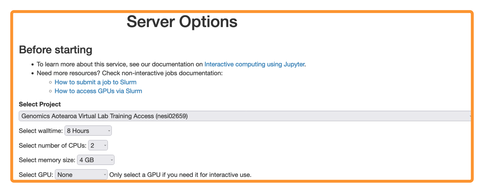

{width="300"}

# **Introduction to Shell**

!!! table "Episodes"

    [1. UNIX, Linux & UNIX Shell](./1-intro2shell.md){ .md-button .md-button--primary } 

    [2. Access the Shell and Introduction to Shell Commands](./2-intro2shellcommands.md){ .md-button .md-button--primary }

    [3. Introduction to Shell Commands - 2](./3-intro2shellcommands.md){ .md-button .md-button--primary } 

 

!!! key "License" 

    Genomics Aotearoa / New Zealand eScience Infrastructure "Intermediate Shell for Bioinformatics" is licensed under the **GNU General Public License v3.0, 29 June 2007** . ([Follow this link for more information](https://github.com/GenomicsAotearoa/shell-for-bioinformatics/blob/main/LICENSE))
    
!!! info ""

!!! copyright "Attribution Notice"

    * This workshop material is heavily inspired by : 
        1. The Carpentries. ***The Unix Shell*** . https://swcarpentry.github.io/shell-novice/
        2. The Carpentries. ***Introduction to Command Line for Genomics***. https://datacarpentry.org/shell-genomics/

!!! info ""

!!! screwdriver-wrench "Setup"

    - If possible, we do recommend using the **Remote** option over **Local**  ( Especially for *Windows* hosts). 

    ### Remote
    
    ??? jupyter "Log into NeSI Mahuika Jupyter Service"
    
        1. Follow [https://jupyter.nesi.org.nz/hub/login](https://jupyter.nesi.org.nz/hub/login)
        2. 
Enter NeSI username, HPC password and 6 digit second factor token 

        3. 
Choose server options as below
         >>make sure to choose the correct project code `nesi02659`, number of CPUs `CPUs=2`, memory `4 GB` prior to pressing {width="40"}  button.
    
         
    
    ### Local 
    
    
    ??? circle-info "Local host setup - Windows, MacOS & Linux"
    
        === "Windows Hosts"
    
            * Install, 
              - MobaXterm Home (*Portable* or *Installer* edition) from [https://mobaxterm.mobatek.net/download-home-edition.html](https://mobaxterm.mobatek.net/download-home-edition.html)
                  * Portable edition does not require administrative privileges 
    
        === "MacOS"
    
              * Native terminal client is sufficient.
    
        === "Linux"
    
              * Native terminal client is sufficient.
    